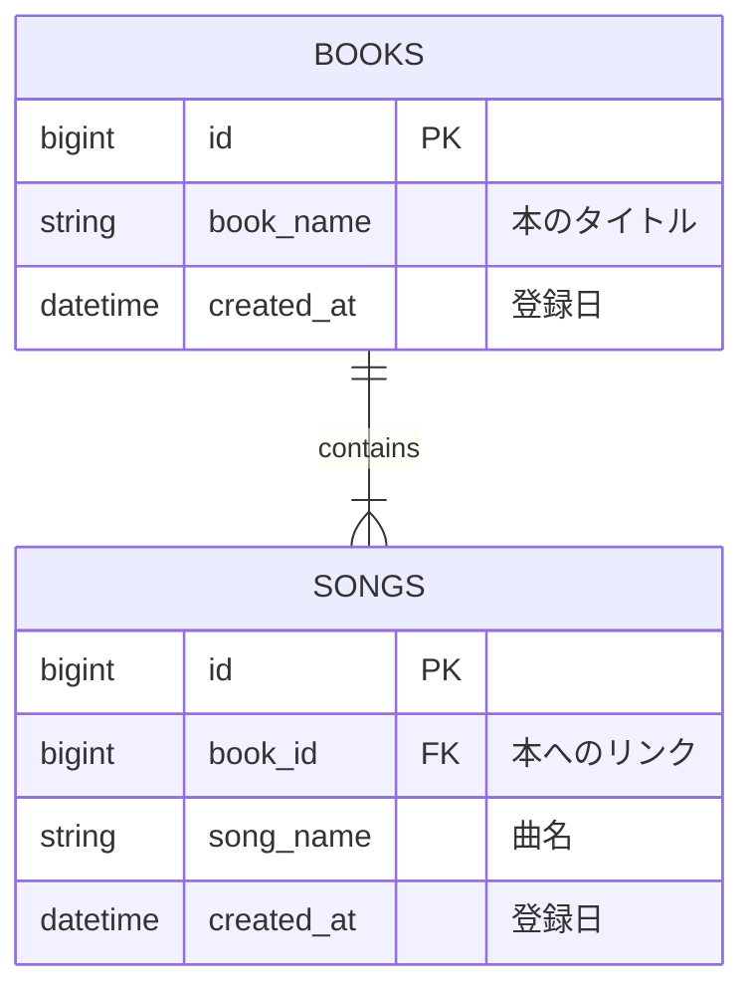

個人開発している楽譜管理アプリ「楽譜館 (Score Manager)」の検索機能の実装に取り組みました。

やりたいことは、「本のタイトル」と、その本に含まれる「曲名」を、区別なく一度に検索して、更新が新しい順に表示するというものです。
例えば「ハリーポッター」と検索したら、タイトルに「ハリーポッター」が入っている本も、曲名に「ハリーポッター」が入っている曲も、全部まとめてリストアップしたいと考えました。

一見シンプルな機能ですが、意外と難しかったのでメモしておきます。

---

## 1. どんなアプリを作っているか？

Score Manager（楽譜館）は、家に溜まった大量の楽譜本やバンドスコアを管理するためのアプリです。

- 本 (Book): 『〇〇ベストヒット集』のような楽譜本。
- 曲 (Song): その本の中に収録されている『Aメロディ』『Bソング』といった楽曲。

やりたいことはシンプルで、検索窓に 「ハリーポッター」 と入力したら…

*   タイトルに「ハリーポッター」が含まれる本
*   曲名に「ハリーポッター」が含まれる曲

これらをごちゃ混ぜにして一覧表示したいです。

## 2. スキーマ
楽譜集のテーブルbooksと曲のテーブルsongsを抜粋すると次のようになっています。



## 表示方法
上記のスキーマで、例えば「ハリーポッター」と検索したとします。
この場合、それぞれのテーブルでは以下のようなデータがヒットする可能性があります。

booksテーブル (タイトルでヒット)

| ID | Title | CreatedAt |
| :--- | :--- | :--- |
| 1 | ハリーポッター曲集 | 2025-01-01 |
| 2 | ハリーポッター劇中曲 | 2024-01-01 |

songsテーブル (曲名でヒット)

| ID | Title (Song) | book_id | CreatedAt |
| :--- | :--- | :--- | :--- |
| 10 | ハリーポッターと賢者の石より、プロローグ | 1 | 2025-01-01 |
| 11 | ハリーポッター劇中曲 | 2 | 2024-01-02 |
| 12 | ハリーポッターメドレー | 3 | 2025-01-02 |

この時、検索結果としては以下のように「本」と「曲」を対等に並べたいです。

| 項目 | Title | 収録先 | CreatedAt |
| :--- | :--- | :--- | :--- |
| book | ハリーポッター劇中曲 | | 2024-01-01 |
| book | ハリーポッター曲集 | | 2025-01-01 |
| song | ハリーポッターメドレー | 映画ベストソング | 2025-01-02 |

（※bookとsongを合わせてcreatedAtで降順。songの場合は収録先として親のbookも表示する）

## 3. どうやってデータを取ってくるか？

### 案1：単純にJOINしてみる

初めに思いつくのは、 `books` と `songs` を `LEFT JOIN` して検索することです。
しかし、これだと「本のタイトルがヒットしたから表示したい」だけなのに、その本に入っている全ての曲が `JOIN` されてしまい、検索結果が重複だらけになってしまいます。

例えば、「ハリーポッター曲集(ID:1)」には曲が10曲入っているとします。本だけを表示したいのに、JOINの結果はこうなります。

| book_name | song_name | ヒット理由 |
| :--- | :--- | :--- |
| ハリーポッター曲集 | 収録曲A | 本のタイトルがヒット |
| ハリーポッター曲集 | 収録曲B | 本のタイトルがヒット |
| ... | ... | ... |
| ハリーポッター曲集 | 収録曲J | 本のタイトルがヒット |

このように、「本」としては1件なのに、DBの結果としては10行返ってきてしまいます。
これをアプリ側で「同じIDだから1つにまとめる」といった処理をするのは、ページネーション（LIMIT/OFFSET）を考えると非常に相性が悪いです。10行取得しても、それが「本1冊分」なのか「曲10曲分」なのか、DBから取得するまで確定しないからです。

### 案2：別々に検索して、アプリ側で混ぜる

1.  `books` テーブルから「ハリーポッター」本を検索。
2.  `songs` テーブルから「ハリーポッター」曲を検索。
3.  アプリ（JavaScript）で2つの配列を合体させて、日付順にソートする。

これは簡単そうですが、ページネーション（続きを読み込む）の時に詰みます。
「上から10件取ってきて」と言われたとき、「本から何件、曲から何件取ればいいか」が事前にわからないからです。

なぜLIMITがかけられないのか？
例えば、全体の検索結果の「1ページ目（最新の10件）」を表示したいとします。
しかし、その「最新の10件」の内訳がどうなっているかは、両方のテーブルを全部見てみないとわかりません。

*   パターンA: 最新10件が すべて本 かもしれません。
*   パターンB: 最新10件が すべて曲 かもしれません。
*   パターンC: 本が3件、曲が7件 かもしれません。

もし `books` と `songs` それぞれに `LIMIT 10` をかけて取得してしまうと、
「実は `books` の11件目が、`songs` の1件目より新しい」
といった場合に、正しい順序で表示できなくなってしまいます。正確にページングするには、結局両方から大量にデータを取ってきてアプリ側で捨てることになり、パフォーマンスが悪化します。

## 4. 解決策：UNION ALL を用いる

そこで採用したのが、SQLの `UNION ALL` を使ったアプローチです。
「本」と「曲」を、共通の型（カラム構成）を持つデータとして整形し、DB側で縦に結合してしまいます。

### 実際のSQL（PostgreSQL / Supabase RPC）

以下のような関数（RPC）を作成しました。

1.  本の検索結果を作る
    *   「ID」「名前（タイトル）」「日付」「bookラベル」などを取得。
2.  曲の検索結果を作る
    *   「ID」「名前（曲名）」「日付」「songラベル」などを取得。ここで親の `books` テーブルをJOINして、収録元の本タイトルも取得しておきます。
3.  `UNION ALL` で結合し、日付でソートしてLIMIT/OFFSETをかける。

```sql
-- Create function to search books and songs with UNION ALL
CREATE OR REPLACE FUNCTION search_books_and_songs(
  search_query TEXT DEFAULT '',
  limit_count INT DEFAULT 10,
  offset_count INT DEFAULT 0
)
RETURNS TABLE (
  id BIGINT,
  created_at TIMESTAMPTZ,
  book_name TEXT,
  song_name TEXT,
  grade TEXT,
  book_id BIGINT,
  result_type TEXT,
  total_count BIGINT
) AS $$
BEGIN
  RETURN QUERY
  SELECT 
    sub.id,
    sub.created_at,
    sub.book_name,
    sub.song_name,
    sub.grade,
    sub.book_id,
    sub.result_type,
    COUNT(*) OVER() as total_count -- ページネーション用の全件数も取得
  FROM (
    -- 1. Books matching book_name
    (SELECT 
      b.id,
      b.created_at,
      b.book_name,
      NULL::TEXT as song_name, -- song用のカラムはNULLで埋める
      NULL::TEXT as grade,
      NULL::BIGINT as book_id,
      'book'::TEXT as result_type
     FROM books b
     WHERE search_query = '' OR b.book_name ILIKE '%' || search_query || '%')
    
    UNION ALL
    
    -- 2. Songs matching song_name
    (SELECT 
      s.id,
      s.created_at,
      b.book_name, -- 収録元の本タイトル
      s.song_name,
      s.grade,
      s.book_id,
      'song'::TEXT as result_type
     FROM songs s
     LEFT JOIN books b ON s.book_id = b.id -- ここでN+1問題を回避
     WHERE search_query = '' OR s.song_name ILIKE '%' || search_query || '%')
  ) sub
  ORDER BY sub.created_at DESC -- 結合後にソート
  LIMIT limit_count OFFSET offset_count;
END;
$$ LANGUAGE plpgsql;
```

### この方法のメリット

1.  ページネーションが完璧: 結合してから `ORDER BY` と `LIMIT` をかけるので、「全体の最新10件」が正確に取得できます。
2.  N+1問題の回避: 曲を取得するパートで `books` を `JOIN` しているので、フロントエンドで改めて「この曲の本のタイトルは？」と問い合わせる必要がありません。
3.  高速: 余計なデータをfetchせず、必要な10件だけがDBから返ってきます。

## まとめ

RDBで「種類の違うデータを混ぜて一覧表示したい」という要件は意外と難しいですが、`UNION ALL` を使うことでスッキリ解決できました。
フロントエンドで頑張ってマージするよりも、DB側で「同じ形」に揃えてあげるのがポイントでした。

次は、この検索結果をキャッシュする戦略について考えたいです。